# zelr

A 64-bit operating system written from scratch for x86. It boots itself off a
disc or a USB stick, through BIOS or UEFI, drives a framebuffer, manages its
own memory, preempts its own tasks, and starts every processor the firmware
describes.

It routes its interrupts through the IOAPIC, finds an NVMe, SATA or ATA disk,
reads the GPT on it, keeps files in directories on a FAT16 or FAT32 volume,
talks to the internet over its own TCP/IP stack, opens an https connection
with its own TLS 1.3 and checks the certificate at the other end against its
own root store, takes input from PS/2 and USB, and runs a desktop whose
programs are real ring 3 processes.

When it fails it says why.

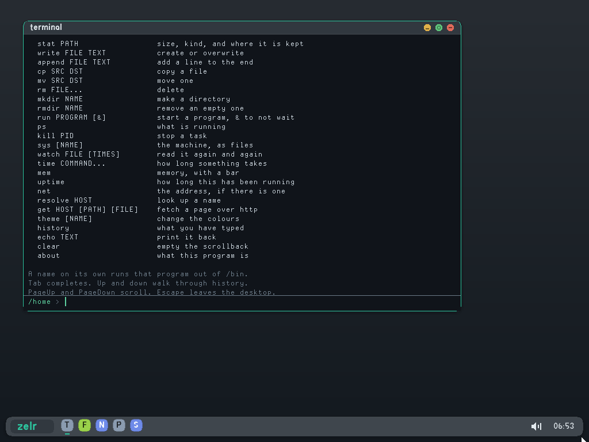

<table>
<tr>
<td width="50%">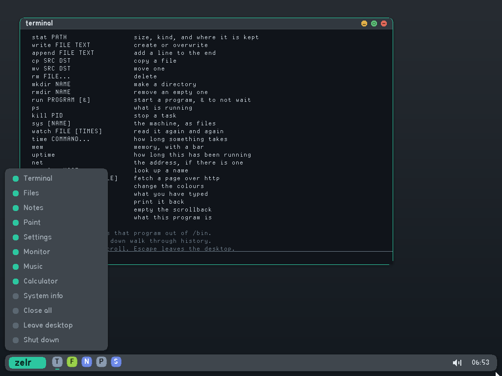</td>
<td width="50%">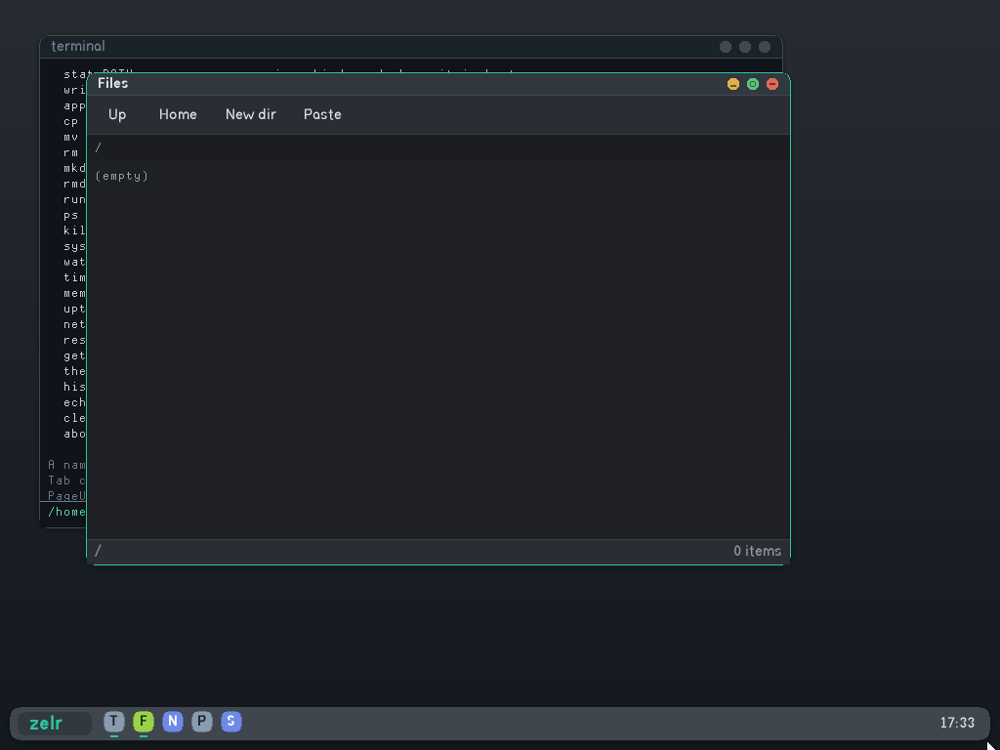</td>
</tr>
<tr>
<td align="center">the launcher, animating open over a running terminal</td>
<td align="center">two windows, and which of them has focus</td>
</tr>
<tr>
<td width="50%">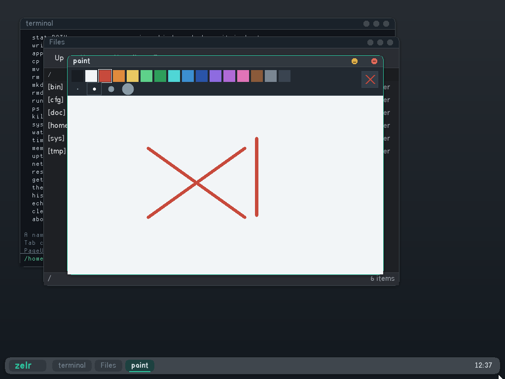</td>
<td width="50%">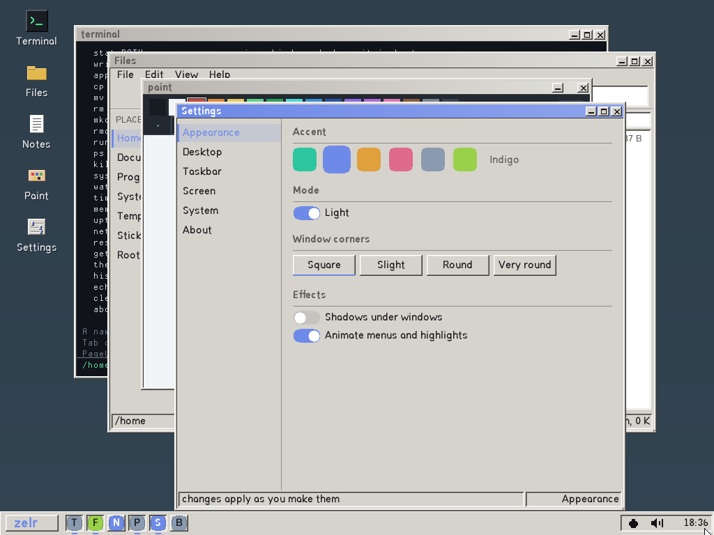</td>
</tr>
<tr>
<td align="center">paint, a ring 3 process like everything else</td>
<td align="center">the theme, which changes as you touch it</td>
</tr>
<tr>
<td width="50%">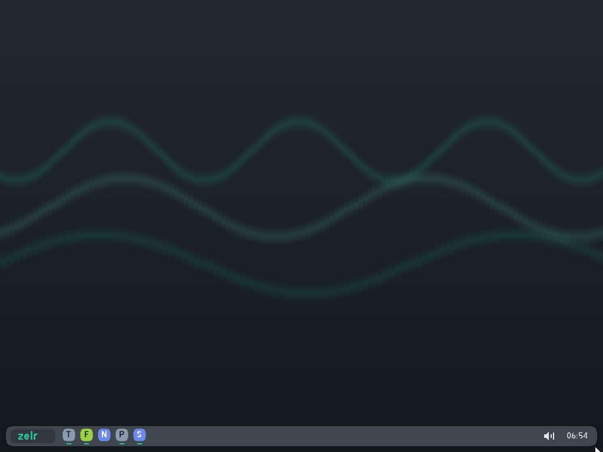</td>
<td width="50%">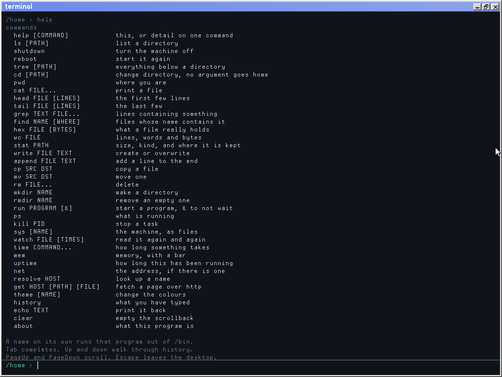</td>
</tr>
<tr>
<td align="center">one of the six wallpapers that move, with the windows swept off it</td>
<td align="center">and the panel tucked away for a window that wanted the screen</td>
</tr>
<tr>
<td width="50%">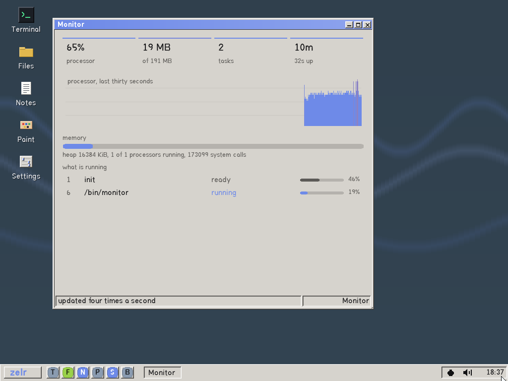</td>
<td width="50%">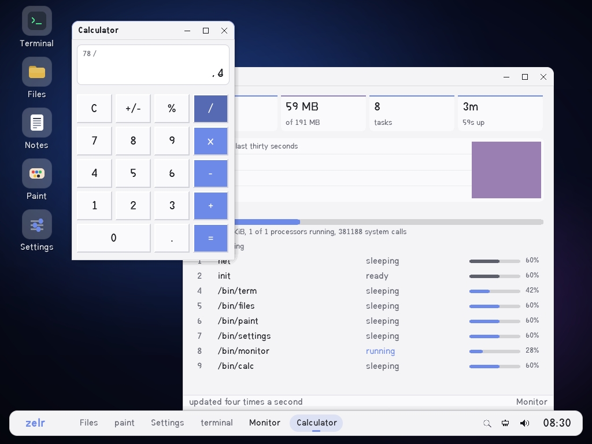</td>
</tr>
<tr>
<td align="center">what the machine is doing, thirty seconds of it</td>
<td align="center">and 78 / 4, worked out without a floating point unit</td>
</tr>
</table>

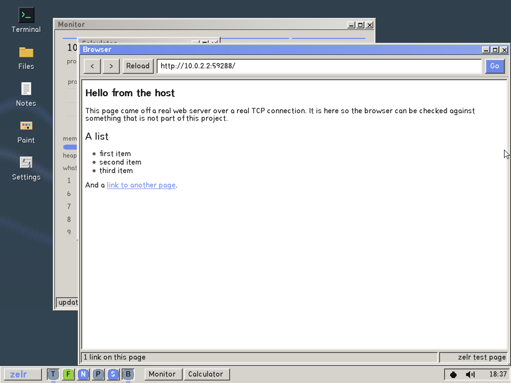

a web browser: that page came off a real web server, over this system's
own TCP, and was parsed and laid out by the program showing it

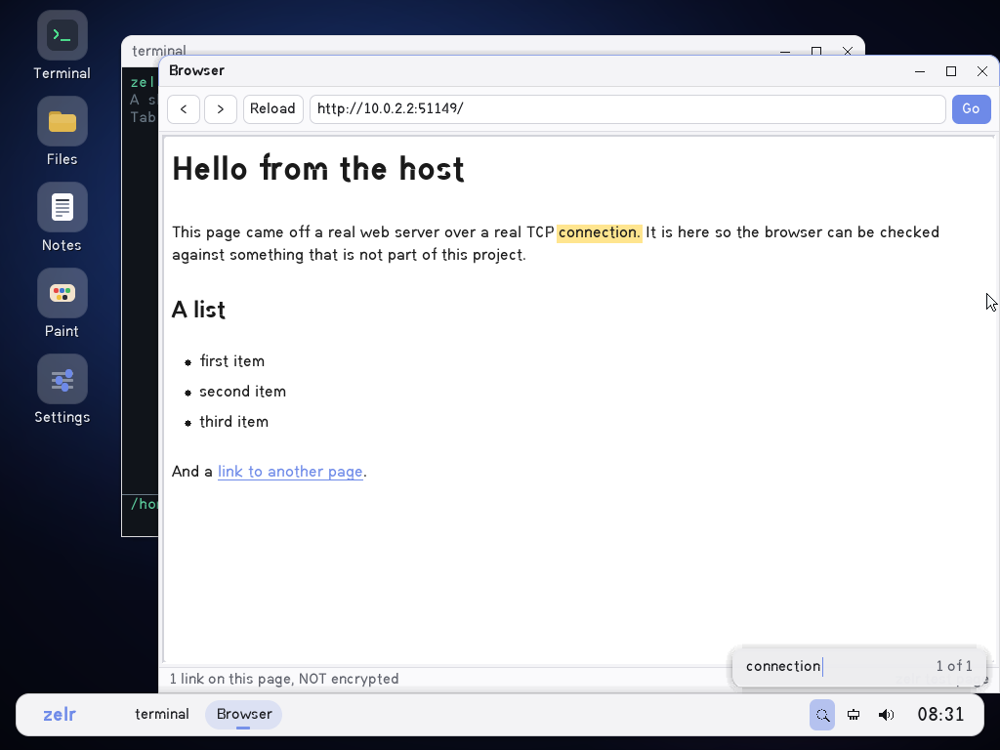

ctrl and f, which looks through what is on the screen rather than
through a list of programs: there is no text in a picture of text, so the
browser says what words it laid out, the desktop counts them, and the
browser paints behind the one it was taken to

Every one of those was photographed by `tools/shots.py`, which boots the
machine, drives it, and saves what came out. They are not mockups and they do
not go stale quietly.

It is not a clone of anything. About 119,500 lines in all, of which 39,700
are generated data that nobody types: the font coverage, the root certificate
store, the typeface at every size a browser might ask for. What is left is
roughly 40,400 hand-written lines of kernel, bootloaders and headers, 25,600
of ring 3 programs, and 13,800 of build and test tooling. No
libc, no runtime dependencies, and nothing borrowed from another kernel:
every driver, the filesystem, the bootloader, the image writer and the font
are written here, from the specifications where there is one and from scratch
where there is not.

The one exception, since "from scratch" invites the question: `zelr.exe`, the
Windows launcher, is a C# program that bundles the .NET runtime, which is
most of its 162 MB. The kernel inside it is about 1.5 MB. Nothing third party
runs on the machine zelr boots.

## running it on Windows

Download **zelr.exe** from the
[latest release](https://github.com/blavese/zelr/releases/latest) and run it.
The kernel is inside that file; nothing needs to be built.

The launcher checks for QEMU, the emulator zelr boots on, and offers to install
it from Microsoft's package manager if it is missing. Then press Start and a
black window opens with the operating system running in it. Type `guide` when
you get there.

It runs as a normal user, needs no administrator rights, and cannot affect
Windows: the kernel only ever sees the pretend machine QEMU gives it. Your
files live in a disk image under `%LocalAppData%\zelr`.

It opens the desktop by itself, with a terminal on it. Escape leaves that
for the console, and `desktop` at the console goes back. Both directions are
there because both are useful: the desktop is what a machine with a screen
should do when you switch it on, and the console is what you want when you
are driving it down a serial line or something has gone wrong.

A terminal opens, over a desktop with icons down the left of it. Click the
name at the left of the dock, or the wallpaper, for the launcher: the
programs by kind -- a file manager, an editor, paint, settings, a system
monitor, a music player, a calculator, a web browser, two card games, and
what the machine is made of, with a field in it that narrows the list as
you type. Press
ctrl and f, or the magnifier in the tray, to look for a word that is on the
screen rather than for a program to start. Drag a title bar to move a
window; the three buttons at its right put it away, fill the screen, or
close it.
Drag the bottom right corner to resize, or drag a title bar to an edge to
snap. Alt and tab changes window, alt and an arrow snaps, alt and d clears
the desktop, and shaking a window sends the others away. Escape returns to
the shell.

The wheel scrolls whatever is under the pointer, the speaker by the clock
sets the volume, and the launcher can switch the machine off. Drag on the
wallpaper to sweep a band over the icons; press the right button on it for
the desktop's own menu.

Everything the desktop is drawn from is a setting. Not the colours and the
wallpaper alone: the dock's height, the gap it floats clear of the edge by,
whether the name and the find button and the clock are on it at all, a window's
title bar and frame and corner, the size of the icons, how long a fade
takes, how close two clicks have to be. Thirty one of them, each a line in
`/zelr.cfg`, and the settings window's Everything page is generated from the
kernel's own list of them rather than written by hand -- so there is nothing
in the file that the window cannot set, and nothing the window sets that the
file does not hold.

Everything on that desktop except the system info window is a separate
program running in ring 3. Settings cannot reach into the window manager at
all; it writes a file, and the window manager reads it, which is why the
desktop changes colour while the settings window is still open.

In the terminal, which is itself one of those ring 3 programs:

    tree /                 the whole filesystem
    cat /sys/memory        what is allocated, worked out as you read it
    ps                     what is running
    run hello              start another program and wait for it
    theme amber            and it is remembered next time

Tab completes commands and paths, up and down walk through history, and
PageUp scrolls back.

    mkdir work
    cd work
    write notes hello
    cat notes

    get example.com / page.html
    cat page.html

That downloads a live web page over TCP and saves it to a disk that survives
closing the window. Over https unless the address says otherwise, which is
the other way round from where this started. A machine with a card asks for an address at startup, so
there is nothing to do first; `dhcp` asks again, for when there was nothing
to answer the first time. `browser example.com`,
or the browser in the launcher, shows the same page laid out rather than as
markup.

## running it on a real machine

Download **zelr.iso**, write it to a USB stick or burn it to a disc, and boot
from it. One file, four ways in, and it picks the right one itself:

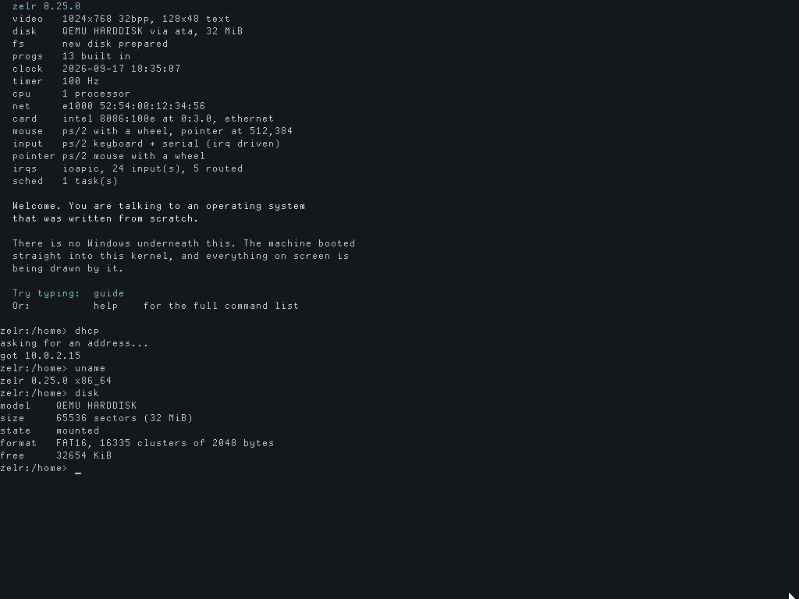

what it says on the way up, before anything graphical happens

| | from a disc | from a USB stick |
|---|---|---|
| **BIOS** | El Torito, first catalog entry | the MBR at the front of the image |
| **UEFI** | El Torito, second entry, platform 0xEF | the partition marked as an ESP |

Both bootloaders are ours. Nothing else is involved: no GRUB, no syslinux, no
isohybrid, and the image is written by `tools/mkiso.py` rather than by
xorriso. The EFI system partition inside it is a FAT16 filesystem built by
`tools/mkfat.py`, not by mtools.

It runs entirely from the disc and writes nothing unless there is a hard disk
attached, in which case it will use it. **Be careful with that on a machine
whose disk you care about**: a blank or unformatted one gets formatted on
first boot.

### what to expect on a laptop made this decade

It will boot and you will get a screen: UEFI hands over a framebuffer and the
desktop draws on it at whatever resolution the firmware picked.

Whether you can then *use* it depends on the machine, and this is the honest
boundary.

**Input** goes through PS/2 where a machine still has it, and through USB
where it does not. There is an xHCI driver and the HID boot protocol, so a
keyboard or mouse plugged into a USB port is found at boot, addressed, and
read; both feed the same buffer the PS/2 drivers fill, so nothing above the
driver knows which one was typed on.

Hubs are walked as well, down the five tiers USB allows, so a keyboard behind
one is found the same way as a keyboard on a port of the machine itself. That
matters more than it sounds on a laptop, where the built-in keyboard is often
behind a hub inside the chipset rather than on a port anybody can see.
Something plugged in after boot is noticed and enumerated from a kernel task,
and pulling it out is noticed too.

A USB stick works too. Mass storage is SCSI posted through two bulk
endpoints, so a stick is enumerated, asked how big it is, read and written a
sector at a time, and mounted: its files are under `/usb`.

What is not there is any other class. Only the machine's own ports are
watched for a change: plug a keyboard into a hub that is already connected
and it is not found until the next boot.

**A USB stick mounts.** Plug one in and its files are under `/usb`, read and
written like anything else, and `cp` moves files between it and the disk the
machine booted from. The block layer holds disks by number rather than
holding one picked at boot, which is what made that possible: a stick
registers itself when it arrives and the volume is mounted from its partition
table, or from the whole device when it has no table, which is the two shapes
a stick comes in.

**Files keep their names.** A FAT directory entry holds eight characters and
three more, and everything since 1995 has carried the real name in extra
entries in front of that one. Both are written and read, so
`a-rather-long-file-name.txt` is what it is called rather than
`A-RATHE~1.TXT`, and a name that always fitted is still stored the way it
always was. tools/readfat.py reads them too, so the two implementations
disagree out loud rather than quietly.

**It turns off.** There is no instruction for that: a machine is switched off
by asking the chipset for sleep state five, and what has to be written to ask
is two numbers the firmware chose and left in its own bytecode. The kernel
finds them by reading it. `shutdown` in the shell.

**Sound** is Intel HD Audio, which is the controller every machine made this
century has. The controller half is small: a list of buffer descriptors and a
run bit, and once it is running whatever is in the buffer is what comes out.
The work is the codec behind it, a graph of converters, mixers and physical
sockets where nothing says which of them you can actually hear. The driver
reads the configuration the manufacturer left on each socket, picks the one
most likely to be the speaker, and walks backwards along the connection lists
until it reaches a converter. Tested by playing notes and measuring the
recording, because every step of an audio driver can report success while
producing silence.

There is a second controller, because HD Audio is not what a virtual machine
necessarily offers: VMware hands a guest whose kind it does not recognise an
Ensoniq AudioPCI, and it does not recognise a system written from scratch. The
ES1370 and the ES1371 are one design with the front end swapped — the same
block of memory, size, format and run bit, which is the whole of what makes a
sound — so they are one driver with two ways of setting a rate and two mixers.
One of them plays the buffer and never says how far through it is, so when the
position register does not move the kernel keeps time for it instead.

**Storage** is NVMe, AHCI and ATA. NVMe is what a laptop bought this decade
has instead of the other two, and it is reached the way the specification
describes: queues in ordinary memory, a doorbell whose spacing the controller
reports rather than one that is assumed, and completions recognised by their
phase bit.

**Partition tables** are read, GPT and MBR, with both of GPT's checksums
verified, so a filesystem is found on a disk somebody else partitioned rather
than only on an image. Neither is written. An existing partition is never
formatted, and the EFI System Partition is never touched: it is FAT, so it
passes every other test, and it is also how the machine starts.

**Filesystems** are FAT16 and FAT32. Which one a volume is gets decided by
counting its clusters, which is the only thing the specification says decides
it; the string "FAT32" in a boot sector is a label and some formatters get it
wrong.

**The boot sector a format writes carries a program**, because the 0x55 0xAA
at the end of it is a promise the firmware acts on: it loads the sector to
0x7C00 and jumps. A formatter that writes the mark and leaves the rest empty
makes a disk that a BIOS will start from and then execute four hundred bytes
of nought out of, which is a machine that works once and then does not, with
a message about invalid memory and no hint of where it came from. So the
sector says the disk is not the one to start from and halts, in twenty five
bytes of real mode. A volume zelr formatted before this was true is mended
when it is mounted rather than reformatted -- the jump and the empty space
behind the parameters, and nothing else, on a volume whose serial says it is
ours and whose jump lands on nought.

**Interrupts** are routed through the IOAPIC, with the firmware's list of
which legacy line really arrives where applied. Almost every machine moves
the timer from line 0 to line 2, and a kernel that assumes otherwise waits
forever for a tick that never comes.

**The machine describes itself** through ACPI: the tables are taken from the
pointer UEFI hands over rather than by searching memory a UEFI machine need
not have filled in, the XSDT is preferred where there is one, PCIe
configuration space is reached through the mapping MCFG describes, and every
processor the firmware lists is started. Until that pointer was wired through,
zelr had no ACPI on any UEFI machine at all, which is to say on every laptop,
and reported one processor whatever the machine had.

So: it boots, draws, finds every core, finds an NVMe disk, reads its GPT,
mounts a FAT32 partition without disturbing the one the firmware boots from,
takes a keystroke from a USB keyboard, and says what happened if any of that
fails.

### when it does not boot

A failure on a laptop used to be a black screen and nothing else. Under QEMU
the serial line carries the whole story out; the first boot on real hardware
is the one run where that is not available, and it is also the run most
likely to fail.

So the kernel narrates itself as it comes up, and there are three ways to
read it back.

**On the screen.** Any panic paints the tail of the log where a camera can
see it: the phase marks in blue, the fault and its registers in red. The last
mark is the thing that did not finish. Photograph it.

**From inside a running system.**

    cat /sys/boot        what this boot did
    cat /sys/lastboot    what the boot before it did

`/sys/lastboot` is the one that matters after a machine has failed to come
up: boot it again, read that, and the last mark names where it died. The
record is lifted off the disk early, before this boot writes its own, so
rebooting to ask the question does not destroy the answer.

**Over serial**, if the machine has a port. Every line is mirrored as it is
written, so nothing has to survive for it to be useful.

The log names what each phase found, not just that it ran, which is usually
the answer on its own:

    [    0] == disk
    [    0] disk none: no controller this kernel can drive
    [    0] == network
    [    0] net no card this kernel can drive

The disk copy lives in sectors reserved at the front of the volume, and is
written **only to a volume zelr formatted itself**. Four things about the boot
sector have to agree before a byte is written, and the sectors themselves
have to be blank or already hold a log. A disk that fails any of those gets
nothing and keeps working; the screen and serial routes are unaffected.

## running it from source

You need QEMU and Zig. Zig is used only as a cross compiler, so there is no
x86_64-elf toolchain to build first.

    ./run.sh          boot in a window
    ./run.sh -t       boot headless, console on stdout
    ./run.sh -T       run the built-in self test, exit code is the result
    ./run.sh -i       build a bootable image and boot it through our own
                      bootloader, the way a real machine would

`run.sh` creates a disk image and attaches a network card automatically. The
first three hand the kernel to QEMU with `-kernel`, which means QEMU is doing
the bootloader's job; `-i` is the one that does not.

The kernel handed to `-kernel` is `build/zelr.bin` rather than the ELF, and
that is not a detail: no multiboot loader will accept a 64-bit ELF, because
multiboot predates long mode. The multiboot header carries the a.out kludge,
which tells a loader to stop reading ELF headers and copy the flat image
instead.

    python tools/mkiso.py       write build/zelr.iso
    bash tools/iso_test.sh      boot it as a disc and as a stick
    bash tools/shell_test.sh    type at the shell over the serial line
    python tools/shotcheck.py   use the desktop and look at the screen
    python tools/termcheck.py   type into the terminal and check the result
    python tools/deskcheck.py   move the windows and check where they went
    python tools/usbcheck.py    boot with usb keyboard, mouse and stick, use them
    python tools/inputcheck.py  type on machines touched while they booted
    python tools/soundcheck.py  play notes and measure what came out
    python tools/enscheck.py    the same, out of the other sound card
    python tools/volcheck.py    drag the volume slider, listen to the result
    python tools/framecheck.py  move the pointer, ask what the frames cost
    python tools/mountcheck.py  mount a usb stick and copy files off it
    python tools/namecheck.py   save long names and read them back
    python tools/powercheck.py  tell it to shut down, see if it does
    python tools/appcheck.py    make the calculator divide, play a file
    python tools/setcheck.py    write a setting by hand, watch the dock move
    python tools/piccheck.py    the decoders and the layout, with no screen
    python tools/abicheck.py    the structs the kernel writes and programs read
    python tools/netcheck.py    click for an address, see if one arrives
    python tools/shots.py       retake the screenshots in this readme

The Windows launcher lives in `launcher/` and is built with
`dotnet publish -c Release -r win-x64 --self-contained true -p:PublishSingleFile=true`.
It embeds `build/zelr.elf` and a starter disk, so build the kernel and run
`userland/build.sh` first.

## what it actually does

**Boot.** Three ways in, all agreeing on one structure.

`bootloader/cdboot.S` is the BIOS one: the firmware drops it at 0x7C00 in
16-bit real mode and it opens the A20 gate, asks for the memory map, reads the
kernel off the boot device in 32 KiB chunks and copies each above 1 MiB
through unreal mode, which is the only way to write there without giving up
the BIOS calls it still needs. It handles both sector sizes, because a disc
reports 2048 bytes and a stick reports 512.

`uefi/loader.c` is the other. A UEFI machine never enters real mode and never
runs a boot sector, so none of that applies: it is an EFI application, a PE
executable the firmware loads and calls. The interface is transcribed from the
UEFI specification in `uefi/efi.h` rather than taken from gnu-efi. It locates
the graphics protocol and picks a mode, takes the ACPI pointer from the
configuration table, reads the kernel off the volume it booted from, and calls
ExitBootServices in the documented loop, because asking for the memory map
allocates, allocating changes the map, and that invalidates the key the call
wants.

Both build the same `handoff_t`, so the kernel has one entry contract and
never finds out which one started it. Multiboot could not have been that
contract: it cannot describe a framebuffer the firmware chose, has no room for
an ACPI pointer, and is 32-bit.

**Long mode.** `boot/boot.S` gets there from 32-bit protected mode, and the
order is fixed by the processor rather than by preference: long mode cannot be
entered without paging already on, and paging in long mode needs four levels
of tables that have to exist first. So it builds tables identity mapping the
first 4 GiB with 2 MiB pages, turns on PAE, asks for long mode, turns on
paging, and only then jumps through a 64-bit descriptor. It refuses to
continue on a processor without long mode rather than faulting somewhere less
explicable a few instructions later. The UEFI path skips all of this: the
firmware is already there.

**Descriptor tables.** A flat GDT (kernel and user code/data) plus a TSS, which
is how an interrupt taken in ring 3 finds a kernel stack to switch to. A 256-entry IDT with
stubs for all 32 CPU exceptions and 16 hardware IRQs, generated rather than
hand-written.

**Interrupts.** The 8259 PICs are remapped off the exception vectors to 32..47.
Exceptions that nothing handles print a register dump and halt, instead of
silently triple faulting.

**Physical memory.** A bitmap allocator, one bit per 4 KiB frame, built from
the firmware memory map. The kernel image and the bitmap itself are marked in
use so they can never be handed out.

**Virtual memory.** Two-level paging. The low 16 MiB is identity mapped so that
enabling paging does not move the ground out from under the kernel, and
map_page / unmap_page / virt_to_phys work for anything above that. Page faults
report the faulting address and whether it was a read or a write.

**Heap.** First-fit free list with boundary tags, coalescing neighbours on
free. kmalloc, kcalloc, kfree.

**Tasks.** Round-robin preemptive multitasking. Each task owns a kernel stack
holding a complete interrupt frame, so switching is a matter of telling the
interrupt return path to unwind a different one. Tasks sleep, yield and exit
with a status somebody can collect, and dead ones are reaped once it has
been, or after a grace period if nobody asks.

Every processor has an idle task, and for a long time none of them did. The
scheduler walked its ring, found nothing runnable, and returned the task it
had been given -- which was the task that had just asked to sleep. So a
sleep from ring 3 could return with no time passed: measured, `sleep_ms(100)`
took 0 ms. Nothing looked like that. What it looked like was a browser that
starved every other program, because it could not yield without stopping;
typing that went lossy under load, because the console was not read often
enough; a compositor that caught every frame half drawn, because no program
was ever between frames; and timer checks in page scripts that had to poll
the clock rather than sleep. Four faults and one cause. The idle task halts,
which is also what lets a processor cool down, and charges its ticks to
itself so the monitor still reads nothing when nothing is happening.

A task can also block on an address and cost nothing while it waits: the
scheduler skips it entirely, and whoever changes that thing wakes everyone
waiting on it. The channel is just an address, so nothing has to be declared
waitable, and a wait can carry a deadline and tell a timeout apart from an
actual wakeup.

**Disk.** Two drivers behind one block layer. AHCI is tried first, because it
is what a real machine and every modern virtual machine present: the driver
builds a command list and a scatter-gather table in memory and lets the
controller do the transfer itself. If there is no AHCI controller it falls back
to ATA PIO on the primary bus, which moves every word through the CPU and needs
no bus mastering setup. Whichever answers, the rest of the kernel sees the same
four calls.

**Filesystem.** FAT16 and FAT32, so the disk is not a sealed box: other
tools can open the image and files move in both directions. The width is
chosen by how many clusters the volume needs rather than named: past what
FAT16 can describe at all, which is where an eight gigabyte disk lands, it
is FAT32. Files are worked on in memory and
written through on every change. Writes are ordered so that losing power part
way through cannot destroy what was already there: the new cluster chain is
written and flushed first, the directory entry is committed as a single sector,
and only then is the old chain released. Anything an interruption stranded is
found and reclaimed at the next mount. A blank disk is formatted automatically
on first boot. `tools/readfat.py` parses the image straight from the
specification, sharing no code with the kernel, and can copy a file in from the
host.

**Network.** PCI enumeration to find the card, then one of three drivers behind
a common interface. The Intel e1000 is tried first, since it is what VirtualBox
presents and what VMware presents to a guest it recognises; it is driven through
memory-mapped registers and descriptor rings the card DMAs into by itself. The
AMD PCnet-PCI II is what VMware hands a guest it does not recognise, which is
anything written from scratch, so it is the card most people who try this on
their own machine will actually get: no registers at fixed addresses, an
address port and two data ports, and a block of memory in a fixed layout that
the card is told to go and read. A Realtek RTL8139 driver covers QEMU's older
default with a circular receive buffer and four transmit descriptors. If none
of them matches, the machine says which controller it found and that there is
no driver for it, rather than saying there is no card. On top of any of them:
ethernet, ARP with a cache, IPv4 with checksums,
ICMP (it answers pings and sends them), UDP, a DHCP client, a DNS resolver, and
a single-connection TCP client with a three way handshake, orderly close, and
retransmission with exponential backoff. `fetch` uses all of it to do an
HTTP GET.

**Two fonts, and one of them is a typeface.**

The first is ninety-five glyphs on an 8 by 16 cell, drawn by hand in
`tools/genfont.py` as pictures made of dots and hashes, which is also how they
are edited. It used to be traced from a system typeface, which made the shapes
somebody else's and put an imaging library in the way of building a font.
Capitals are nine rows, x-height is six, stems are one pixel. It draws the
boot console, where a fixed cell is what is wanted and there is nothing to
anti-alias against yet.

The second is a real typeface. Each glyph in `tools/genface.py` is an outline
on a thousand unit em, built out of stems, bars and arcs from proportions
written down once at the top, and filled by measuring how much of each pixel
lands inside it. That gives eight bits of coverage per pixel instead of a
yes or no, and it works at any size, because the outline is scaled before it
is measured rather than after. Nothing is imported and nothing is traced.

A bold cut is the same drawing with heavier strokes rather than a second set
of outlines, which is the point of having the proportions in one place. The
`a` is double storey, which is the letter that decides whether a face reads as
humanist or as something geometric; it was single storey for a while, and the
one letter that turns up in almost every word was the one letter out of step
with the rest of the alphabet.

The sizes are chosen against what uses them. Window chrome gets four, because
this system picks those sizes itself. A browser gets thirty-three, because a
page asks for whatever size it likes in whatever unit it likes and takes the
nearest: with four, a heading and its subheading came out identical and a
caption came out as body text. Those thirty-three are half a megabyte of
coverage and live in a header of their own, since a calculator has no business
carrying them.

There is a monospaced cut, and it is not the proportional one with the advance
replaced. That is the obvious thing to try and it does not work: `m` and `w`
are half again as wide as the cell and run straight into whatever follows
them. So anything wider than the cell is condensed into it and anything
narrower is centred in it, which is how a monospaced face derived from a
proportional one has always been made. The wide letters come out a little
narrow and the narrow ones have air around them; what it buys is that column
n sits under column n on the line above, which is the only thing a terminal
actually needs. The terminal and the editor draw with it, and used to draw
with the 8 by 16 bitmap — the one thing on the screen with a staircase on
every character, which no amount of rounded corners anywhere else makes up
for.

**Graphics.** Mode setting through the Bochs VBE dispatch ports rather than a
BIOS call, so it works from protected mode with no real mode trampoline and no
help from the bootloader. The aperture is found through the VGA device's PCI
BAR and mapped explicitly. Drawing goes to a back buffer, because compositing
directly in video memory over PCI is visibly slow. What is sent to the card is
the part of that buffer which differs from what the card was last given: a copy
of it is kept and compared a band of rows at a time, so moving the pointer
costs two bands of forty eight rather than three megabytes. Half of that
comparison goes to another processor when there is one to spare. The console is
redrawn on top of it all with a bitmap font, so everything that already printed
kept working.

**Other processors.** A PC boots with one CPU running and does not say the
others exist, so `acpi.c` goes and reads the firmware tables to find them and
`smp.c` starts each one with an INIT signal followed by a startup signal
carrying a page number. It begins executing there in real mode with no stack
and no paging, which is what `bootloader/trampoline.S` is for. What they do
afterwards used to be: wait for a function to be handed to you, run it, go
back to sleep. That is real parallelism with a small surface and it is not a
processor running anything -- a machine given four cores ran every program
on one of them.

They run programs now. Each has a task state segment of its own, because
that is where a processor finds the stack to switch to when an interrupt
arrives from ring 3 and two processors sharing one would take their
interrupts onto the same kernel stack. Each has a current task of its own,
and a timer of its own: the 8254 sends its tick to one processor, and
without an interrupt of its own whatever a processor picked up would run
until it gave the processor back.

One lock covers the kernel. A processor holds it whenever it is not
executing ring 3 code, which is the coarsest lock there is and the honest
one to start with: the alternative is a lock on the heap, the task list, the
filesystem and every driver, which is not one change but forty, and the
first wrong one is a machine that corrupts itself occasionally. It works
because the kernel is already non-preemptive -- system calls arrive through
an interrupt gate, so no timer lands in the middle of one.

What decides whether to give the lock back is the frame being returned
through rather than what kind of task it is. Asking whether the task was a
program looked right and was wrong: a program preempted in the middle of a
system call is a program by that test, so it was resumed without the lock
and carried on in the kernel with nothing holding anybody else out. It
failed about one run in three, somewhere different each time.

Kernel tasks stay on the boot processor. The handing out of functions is
still there, because the compositor gives half of every screen comparison to
whichever processor is free, and what it hands over is arithmetic over memory
the caller owns rather than anything the kernel keeps. `cat /sys/cpu` says
how many slices each processor has given to a program.

**Programs.** Ring 3, its own address space per process, and fifty-eight
system calls through int 0x80. A program can start another program, block
until it finishes and read what it returned from `main`, so the terminal
starting `paint` is one ring 3 process starting another with the kernel only
lending a hand. An ELF32 loader maps each PT_LOAD segment where the
file asks and refuses anything that would land in kernel memory. `userland/`
holds programs built entirely separately: the only thing they share with the
kernel is the syscall numbers. They are then pasted whole into the kernel
image, so a fresh install already has something to run. They are deliberately
never saved to the disk: if they were, the first boot would write them out and
every later boot would run the written copies, so rebuilding the kernel would
appear to change nothing.

That is what `/bin` is, and for a long time it was the only place a name was
looked for -- so a program had to be built into the machine to be run by
typing its name. The loading was never the missing half: every spawn reads
through the same VFS as `cat`, so an ELF on the disk has always loaded and
run. A name is looked for in the working directory first, then `/usb`, then
`/bin`: a program somebody has just downloaded or copied is the one they
mean, and a name in both runs the one in front of you rather than the one
that shipped.

**Processes, the way Unix means the word.** Starting a program used to be
one call: hand over a path, get back a pid. That is a spawn, and it is not
what a shell is built out of. A shell needs to make a copy of itself, change
something in the copy, and only then become the new program, because
everything it wants to arrange first belongs to the child and must not touch
the parent.

So `fork` shares the address space and then copies the saved interrupt frame
with one register changed — the one a system call's answer comes back in. That
single register is why both sides return from the same line with different
answers, and it is the whole of the trick.

Shares rather than copies, because the case a shell spends all day on is a
fork followed by an exec, and every byte copied by that fork is thrown away
a moment later when the child replaces the address space it was handed. Both
sides point at the same pages with the write bit off; the first write on
either side faults, and that page -- only that page -- is copied. When
nobody else is left holding it there is nothing to copy and the write bit
simply goes back on, which is what stops a long lived program that forked
once from paying for it forever. Measured on a program holding four
megabytes: the fork cost 4208 KiB before and costs 40. `exec` does the opposite: it makes
no process at all, it throws away the program running in one and rewrites the
frame the interrupt return is about to unwind, so it never returns.

**Descriptors, which are two things rather than one.** An open file used to be
an index into one kernel-wide array tagged with a pid. That worked and it was
not a process model: the numbers were global, a child inherited nothing, and
there was no such thing as standard output to redirect. Now there is a table
of open file descriptions — the file, the position in it, whether it may be
written — and a small array per process mapping the numbers a program uses to
them. `fork` copies the array, so a child inherits what the parent had open.
`exec` keeps it, which is the point. `dup2` puts one description at another
number, and that is redirection written out in full.

Every program became redirectable when one line of `sys_write` changed, and
not one of them was recompiled to know about it: they write to descriptor 1
as they always did, and what 1 means is now somebody else's business.

**A pipe** is a ring buffer with three rules. A reader with nothing to read
waits; a writer with nowhere to put it waits; and the third is how it ends: a
read on an empty pipe with no writer left returns zero rather than waiting,
because zero is how every program already spells end of file, and a pipeline
whose left hand side has finished must not hang its right.

**Stopping one.** Until there were signals, a program that looped held the
console until the machine was restarted, which is the difference between a
shell you can use and a shell you can demonstrate. A signal is raised where
the keystroke arrives rather than where the console is read, because by the
time anybody reads the console the program being interrupted has not read
anything for a while — it is off in a loop, which is why it is being
interrupted. And it is acted on in the scheduler, because that is the one
place every task passes through whatever it is doing: a program spinning in a
loop makes no system calls and would never notice a signal checked on the way
out of one.

**And a shell that is a program.** `/bin/sh` knows three system calls — fork,
dup2 and exec — and everything it does is those three arranged differently.
`cmd > file` is a dup2 between the fork and the exec. `a | b` is a pipe, two
forks and a dup2 on each side. `cmd &` is not waiting. There is no fourth
mechanism and no list of commands inside it: a program written tomorrow runs
exactly as well as one that shipped with the kernel. The shell in the kernel
is still there, because a machine with no `/bin` still has to be usable, but
it is no longer the only one.

**And the pages can run.** The engine in `userland/js.h` knows nothing
about pages — it runs a language, and it was written that way so it could be
tested without one. What it has instead is two hooks, how a property on a
host object is read and written, and `userland/jsdom.h` is the browser
filling them in.

An element is a plain JavaScript object with its index in the document
written on it, so reading `el.textContent` walks the document as it stands
rather than a copy taken when the object was made, and writing it changes the
document the layout is about to read.

The world a script runs in is opened when the page is built and closed when
the page is left, rather than torn down the moment the scripts finish. That
is the difference between a page something happened to and a page that is
running: a handler is by definition a piece of a program that runs after the
program has finished, and before this there was nothing left for one to run
in. A page with no script and no handler attribute opens nothing and costs
nothing, which is still most pages.

What is bound is what a page can actually do. Reading and finding:
`getElementById`, `getElementsByTagName`, `textContent`, `className`,
`classList`, `id`, `tagName`, `value`, `checked`, `getAttribute`,
`setAttribute`, `parentNode`, `parentElement`, `firstChild`, `lastChild`,
`nextSibling`, `previousSibling`, `children`, `querySelector`,
`querySelectorAll` and `document.title`. Changing: `createElement`, `createTextNode`,
`appendChild`, `insertBefore`, `removeChild` and `remove`. Hearing:
`addEventListener` and `removeEventListener`, `onclick` and its relatives,
with an event that carries the element actually hit, `preventDefault` and
`stopPropagation`, delivered from that element up to the document. And
later: `setTimeout`, `setInterval` and the two that cancel them.

Appending a node that is already somewhere moves it, and putting an element
inside its own descendant is refused — that one is not a wrong answer but a
ring, and everything that walks children until there are none walks it
forever.

The selectors are the ones the style sheets already use, rather than a
second implementation of the same question. A page's idea of what
`nav > a.current` picks out has to be the same whether it came from a sheet
or from a script, and two of those agree until they do not -- and the day
they stop is the day a page styles one element and scripts another.

And the language has regular expressions. Literals and character classes,
anchors, groups capturing and not, alternation, and the repetitions each
greedy or lazy, with the g, i and m flags; `test` and `exec` with
`lastIndex`, and `match`, `search`, `split` and `replace`, the last with
`$1` and `$&` or with a function if the page would rather decide. No
lookahead, no lookbehind, no backreferences and no named groups: those are
refused when the pattern is compiled and the script is told which, because
a page that says what is wrong can be fixed and a page that silently
matches the wrong thing cannot.

The interesting part of that is the slash, which is the same character as
the one that divides. `a / b` and `/ab/` differ only in what came before,
so the lexer carries whether the token it just read could end an
expression -- after a number, a name, a string or a closing bracket a slash
divides, and anywhere else it opens a pattern.

Arrow functions, `instanceof` and labelled `break` and `continue` are here
because google's front page asked for them and said so one script at a
time. `instanceof` is not a walk up a prototype chain, because there is no
chain a script can reach into; every object made with `new` remembers what
made it instead. What is missing there is inheritance, and that is written
down rather than left to be found, because a false where a page expected
true is a branch not taken and the page looks like it decided something
rather than like it broke.

What is still absent is absent rather than approximated: no capture phase,
because a listener registered for capture and run at bubble time is worse
than one not run; no `innerHTML`, because that means running the parser
over a fragment and this parser builds whole documents; and no classes, no
generators and no `async`, which the parser refuses by name. A script that
uses `class` is told this engine does not have classes, which is a fact
somebody can act on, where treating it as an identifier would produce a
syntax error four lines later about something unrelated. A property that is
missing is better than one that quietly returns undefined and lets a page
believe it worked.

**And the forms work.** An `<input>` used to be laid out as nothing at all:
the layout had a name for a field and never made one, so there was no box to
click, nothing to type into and no path from a filled in form to a request —
which is to say a search box, the commonest thing on the web, did not work.
Text fields, passwords, checkboxes, radio buttons, textareas, buttons and
hidden fields are drawn now, take the keyboard, and are sent on Return or on
the button. A control keeps its value in the document as the attribute a
page would have written it in, so the layout, the drawing, a script asking
`el.value` and what is submitted are all one answer rather than four that
agree until somebody types.

`GET` puts the fields in the address and `POST` puts them in a body, which
is the whole difference between a form and a password in a server's log. A
redirect after a `POST` is followed with `GET` for 301, 302 and 303 and with
the method kept for 307 and 308, because sending the form again to wherever
it was sent is how somebody orders twice.

**Windows.** A compositing window manager: windows are off-screen surfaces,
the manager owns the chrome, the stacking order and the pointer, and the whole
screen is assembled into the back buffer and pushed once per frame so a window
moving over another leaves no trail. Title bars drag, clicking raises, the
close box closes, and a chip on the dock shows what is open.

**Find, which is not a launcher.** The dock used to carry a wide field
down the middle of it, and all that field did was open the launcher — a
second way to start a program on a desktop that already had one, sitting in
the part of the bar the window chips grow into, so a machine with a few
windows open had nowhere to put them. It is a button in the tray now, the
size of the clock beside it, and ctrl and f opens it too.

What it opens looks through what is on the screen. That cannot be done by
looking: a window is a rectangle of pixels and there is no text in a picture
of text. So a program says what it is showing — the browser publishes the
words of the page as laid out, the terminal the lines you can still see —
and find looks through that. The bar counts what it found, takes you to it,
and the program paints behind the word so you can see which one it meant.
A program that has said nothing is not searched and is not pretended to be,
which is why the bar says how many windows it can look in: "nothing to look
at" and "that word is not here" are different answers and the count tells
them apart.

**The dock.** A bar welded to the bottom of the screen means a maximised
window is not maximised: it stops short, and the last thirty pixels of the
display are spent on something that is looked at occasionally. A bar that is
always hidden means reaching for it every time, which is worse. So the
default is neither. Nothing wants the room and it is out, floating clear of
the edge with the wallpaper showing around it; something does and it slides
away and the window has the whole screen; put the pointer at the bottom and
it comes back over the window, and stays as long as the pointer is on it.

That is the default and not the rule. All three answers are a setting --
never tuck away, tuck away when a window needs the room, or always -- along
with the height, the gaps, the corner and what is on it. A gap of nothing
welds it back to the bottom edge, which is what this was for fifteen
versions.

A window covering the whole screen also means the wallpaper and everything
under that window are being drawn and then painted over, twelve times a
second if the wallpaper is one that moves. Neither is drawn at all now.

It used to keep a row of pinned apps, and no longer does. Six coloured
letters in circles said which six programs somebody had chosen and nothing
else: to reach a seventh you opened the launcher anyway. What reaches all of
them is the launcher's own field, the same size whatever is installed, and
it takes text -- a substring rather than a prefix, so "ain" finds Paint and
return runs it.

For a while a second field sat in the middle of the dock, and all it did was
open that launcher. It was a start menu for a desktop that had one, in the
part of the bar the window chips grow into, so a machine with a few windows
open had nowhere to put them. The middle of the bar is bare now and what is
in the tray is a find, which looks for a word on the screen rather than for
a program to start.

There are no icon files anywhere in this project. The five on the desktop
are drawn: flat shapes in a thirty two unit square, scaled to whatever size
the icons are set to, so a bigger icon is a bigger drawing rather than a
small one in the corner of a large tile.

**The screen, at whatever size.** Nothing on this desktop knows a
resolution: every window, the panel, the launcher and each wallpaper is laid
out from the width and height of the framebuffer, every frame. So the size
can change while the machine is running. Pick one in the settings window and
it is written into the same file the colours live in; the window manager
reads that four times a second, asks the card for the mode, and refits the
windows around what came back. A size the card will not take leaves the
screen exactly as it was, because the new back buffer is allocated before
the old one is let go and the card is asked what mode it is actually in
rather than told.

Where the mode came from decides whether it can be changed at all, and the
settings window says which it is rather than offering a list that does
nothing: a mode this kernel set through the dispatch interface can be set
again, and a framebuffer a UEFI machine handed over is the size the firmware
chose for as long as the machine is on.

**The window server.** A program in ring 3 cannot touch the framebuffer and
cannot be handed a kernel pointer, so a window's pixels are allocated on a page
boundary and mapped into the calling process with the user bit set. The program
draws into that memory directly and asks for a repaint; the kernel keeps the
window and hands back only a small integer handle, checked against the caller
on every call. Input travels the other way through a per-window event queue.
`paint` is an ordinary ELF executable that uses nothing else: sixteen colours,
four brush sizes, and strokes interpolated with Bresenham, because the mouse
reports in jumps and without it a quick stroke is a row of dots.

**Drivers.** Framebuffer and VGA text consoles, PS/2 keyboard with
shift/caps/ctrl/alt, arrows and function keys, PS/2 mouse with a drawn
pointer, PIT at 100 Hz, and a 16550 serial port driven by IRQ4. A key carries
the modifiers that were held when it was pressed rather than when it is read,
because by then a chord has usually been let go.

**The filesystem.** Six directories. `/home` is yours and where the shell
starts, `/doc` is what shipped, `/cfg` is what programs remember, `/tmp` is
emptied at boot. The other two are not stored anywhere: `/bin` holds the
programs that live inside the kernel image, and reading a file in `/sys` runs
the code that works out the answer, so it is never stale. Files that ship
with the system are offered once, recorded by generation on the disk, so one
you delete stays deleted.

**The desktop's programs.** The terminal, paint and settings are ordinary ELF
executables in ring 3. The terminal is a shell that is not part of the kernel:
listing a directory, reading a file, writing one, starting another program and
fetching a page over TCP all go through int 0x80, and its `get` command does
an HTTP GET from user space. It has a line editor, history kept in `/cfg`, tab
completion over both commands and paths, and thirty-six commands of its own.
Settings is the interesting one, because it changes how the desktop
looks without being able to reach the window manager at all. It writes
`/zelr.cfg`, a plain "key value" file, and the window manager re-reads that four
times a second. Anything the window can do can also be done with the shell's
`write` command.

Eleven wallpapers, six of which move: drifting stars, travelling waves,
aurora, rain, wandering orbs and rings going out from the middle. They are
all cheap on purpose, because this has to stay smooth on a machine with no
graphics acceleration of any kind: a column fill or a few thousand points a
frame, never a calculation per pixel of the screen. The curves come from a
seventeen entry table, since the kernel is built with no floating point in it
at all.

**Eleven programs.** The terminal, the file manager, the editor, paint,
settings, a system monitor, a music player, a calculator, a web browser and
two card games, all ring 3 and all using nothing the kernel does not offer
everybody. The browser has a section of its own further down, because what
is interesting about it is not that it is a program.

The monitor is the one that says most about the machine, and the number it
puts at the top took two goes. The scheduler counts slices, one for whichever
task it picked on each tick, and the share of ticks handed out looks like the
answer. It is not: this is a round robin kernel, so a loop waiting for a key
is picked every tick and spends the slice halted. Measured that way an idle
machine reads a hundred per cent, and it did.

So a loop that is only waiting says so, the kernel counts the ticks it slept
through, and slices minus those is work. Two things came out of that. The
processor figure means something, and the desktop stopped spinning its loop
as fast as the processor would go when there was nothing on it to draw, which
on a laptop is the difference between a warm machine and a cool one.

The calculator is integer arithmetic, because there is no floating point
anywhere in this system: the kernel is built with the vector registers turned
off and a program that used a double would fault on the first instruction
that touched one. Everything in it is a sixty four bit count of millionths.

The music player reads WAV files, which is a header and then the samples.
The hardware plays at one rate and in stereo and will not be argued with, so
a file recorded at some other rate is stepped through at a ratio held in
sixteen fixed point bits and a mono file has each sample written twice. Put
one on a USB stick, plug it in, and it is under `/usb`.

**Two card games**, which are one program each and a pile of shared rules.

Blackjack is a six deck shoe reshuffled at three quarters, a dealer that
stands on every seventeen including a soft one, blackjack at three to two,
double on any two cards and after a split, splitting to four hands with
split aces taking one card each, insurance against an ace, and late
surrender. Every one of those is a decision a real table makes differently,
so the ones this table made are written at the top of the file: a game that
does not say which rules it is playing is one you cannot tell is wrong. The
two that cost the player are in on purpose -- the dealer peeks under a ten
or an ace so nobody doubles into a blackjack that was already there, and an
odd bet paying three to two rounds down, the way a table does.

Poker is no limit Texas hold'em against three opponents, with blinds, a
button that moves, four betting rounds, and side pots. The side pots are the
part that makes it a poker program rather than a program that deals cards:
a player who is all in for less can only win the layer of the pot they paid
for, and the rest goes on without them. The odd chip in a split pot goes to
the first winner left of the button, because a chip cannot be halved and
somebody has to have it. Heads up, the button posts the small blind and
speaks first before the flop and last after it, which is the opposite of
every other seat count and is where a game that just walks left from the
button plays its last hands wrong.

The opponents cannot see your cards. There is no function that takes another
seat's hand: each of them is given its own two cards and the board, scores
them, and decides against what the pot is offering. They bluff about one
time in nine from a hand they would otherwise check, because an opponent
that never bluffs is one you can fold against forever.

None of that is drawn from a picture. There is no image file for a playing
card any more than there is one for a desktop icon: the pips are discs and
triangles sized from the card, so a bigger card is a bigger drawing. The
shuffle is Fisher-Yates walking down, over a generator seeded from the clock
and then stirred by every click and keystroke -- a generator seeded from the
clock alone deals the same cards to a machine that boots and starts the game
at the same moment, which on a machine that boots in four seconds is not a
rare accident.

The two games used to draw into memory of their own and copy the finished
frame over at the end, and that is in the window server now where it belongs.
A window's surface was the pixels the desktop composites from: `win_commit`
marked the window dirty and swapped nothing, so there was no moment at which
a frame became finished. The first thing a frame does is paint the table over
everything, and the compositor is a task like any other, so it ran in the gap
before the cards went back on. What that looked like was a maximised poker
game with no cards, no seats and no buttons in it -- a timing fault wearing a
drawing fault's clothes, and one every graphical program would have had to
work around for itself.

**Opening a file.** A program could be started and could not be told
anything, so a file manager could offer to open a file in the editor and had
no way to say which file. A task now carries one string, which for everything
that uses it is a path: the file manager decides from the name which program
should have it, and that program is told which file. The terminal passes one
too, so `music /usb/tone.wav` and `notes readme` do what they look like.

**Scrolling.** A PS/2 mouse reports three byte packets because that is what a
mouse reported in 1987, and only starts sending a fourth after it is asked in
a way no ordinary sequence of commands would produce by accident: three
sample rates in a fixed order, and then asking the device who it is. One with
a wheel answers 3. Above the driver it is one number, steps since somebody
last looked, and the window manager hands it to the window under the pointer
rather than the focused one.

**Two looks, and both of them complete.**

A surface can be said two ways, and this draws both. `look 0` is material:
a soft corner measured rather than stepped, a hairline instead of an edge, a
panel that lets the wallpaper through it, and light as a sheen across the top
rather than a line down one side. `look 1` is built, which is everything
described below. Neither is more correct than the other and the setting is
one line in `/zelr.cfg`.

Material is the default. The built look was, and having chosen it once the
whole desktop was locked to a particular decade, which is a strange thing for
a setting to decide on somebody's behalf.

What material actually costs is three routines in `gfx.c`: a rounded
rectangle whose corners are measured with sixteen samples per pixel rather
than stepped, a soft round light, and a gloss. The corner one is the whole
difference between a curve and a staircase, and it is sixteen comparisons
per edge pixel, of which there are a few dozen per window.

The rest follows from the palette. A modern surface is near white, because
nothing on it is a bevel needing room above and below; a built one is a warm
grey for exactly the opposite reason, set out below. Both are derived from
the same three colours in the theme, so the six accents and the dark ground
work under either.

The focused window is edged in the accent. Under the built look a title bar
was a band of it and there was no doubt; with a flat title bar the only thing
left saying which window the keyboard is talking to is the depth of its
shadow, and nobody reads a shadow deliberately.

**A desktop that is built rather than tinted.**

The whole of the look is one idea: a surface is not a colour, it is a plane
with a light above and to the left of it. Everything raised has a bright top
and left and a dark bottom and right, everything sunk has it the other way
round, and a control says what it is by which way its edges go. A button is
raised, so it can be pressed; a list is sunk, so it cannot. Pressing one does
not tint it, it turns the bevel over and moves the label a pixel down and
right, so the thing is genuinely depressed. That reads as a press at any size
and in any palette, which a colour change does not.

Two pixels rather than one, because one is a line and two is a bevel: the
outer pair carry the strong colours and the inner pair the soft ones, and
together they read as a chamfer.

It is a grey and not an off-white for a reason that took a rebuild to see.
Chrome built out of edges needs a surface with room above it and below it,
and a near-white one has nowhere to put a highlight: every bevel collapses to
a single grey line and the whole desktop goes flat. So the ground is a warm
neutral a few steps down, which is the only part of this that is a matter of
taste rather than mechanics.

Windows are square under this look, because a bevel has to turn a corner to
read as one and a rounded corner has nowhere to put four edges. Nothing casts
a shadow, because a bevel already says which way is up and a drop shadow on
top of one is two answers to the same question. The panel is flush to the
bottom edge and the full width of it under either look, because a panel is
part of the machine rather than a card lying on the desktop.

All of it comes out of the theme, so the six accents and the dark ground
still work: the four edge colours are derived from the surface the same way
every other colour here is, and a program gets them in the same struct it
already reads. One header changed and every window in the system changed
with it, which is the test of whether a toolkit is one.

**A menu bar, at last.** File, Edit, View, Help. The thing most missing from
this desktop: every window had its commands behind whichever button its
author found room for, so no two programs put anything in the same place and
nothing was discoverable. The file manager has one now, and everything in it
does what the toolbar button or the context menu does. A command reachable
two ways is not duplication, it is the difference between a program you can
learn and one you have to be told about.

**Desktop icons, drawn rather than stored.** A bitmap for each would mean a
file format, a loader for it and a directory to keep them in before anything
appeared on the screen at all, and at thirty two pixels a drawn shape and a
stored one are the same picture. Single click selects, a second within half a
second opens, because dragging one has to start with putting the pointer on
it. A program's first window opens to the right of them rather than on top,
which is the only reason to have put them on the left.

**A click that was never delivered.** A window's events arrive through a ring
of thirty two, and a pointer crossing the screen fills it with nothing but
positions. So the press was dropped for want of room, the release turned up
once the backlog had drained, and a release with no press before it sets
nothing: the program sees the button go up from a state where it was already
up. Nothing in the path reports a dropped event, so what this looked like was
a button that did not work, three times over, with the pointer sitting on it
in the photograph.

Positions are folded into one another now, so the ring cannot fill with them.
Which events count as positions took a second attempt: the release carries no
buttons and so does the move after it, and folding one into the other on that
alone puts the release wherever the pointer went next, which for a button
means it was let go somewhere else and the click is lost again. An event is
overwritten only when it carries the same buttons as the one before it and
the one after it.

**A web browser.** It opens a TCP connection with this system's own stack --
one of several, now that there are several to be had --
asks a server for a page, reads the HTML, lays it out against the width of
its own window and draws it with the letterforms in `face.h`. There is an
address bar, a history with back and forward, a scrollbar, and links you can
click.

It used to have no CSS at all, and drew pages the way pages were drawn
before there was any: headings bigger, links blue, one column. That is a
defensible answer for a document and the wrong one for the web as it is,
where the difference between a menu and a list of links, or between a
sidebar and the article, exists only in a style sheet. Without one a page is
not simplified — it is read in the wrong order, and nobody is told that is
what is happening. So there is a style sheet reader now: selectors with the
three combinators that matter, the cascade in specificity then source order,
inheritance, the box model, and block, inline and flex layout.

Inline boxes have edges. An inline element's margin, border, padding and
background are applied on the left and the right, which is the difference
between a navigation bar and the word `GmailImages`: on a real page the gap
between two links written one after another is padding and nothing else. The
top and bottom deliberately are not, because padding above an inline box
does not move the line it sits on, and a layout that pushed the line down
would space every paragraph containing a styled word differently from one
without. A box that begins on one line and ends on another is drawn as
nothing rather than as a band across everything in between.

A page that asks to be replaced by another with `<meta http-equiv="refresh">`
is followed, bounded and never to its own address, because a page that
refreshes to itself is a loop every browser has had to stop.

And the page can be used rather than only read. A click goes to the page
before it goes to the browser, so a page that says the ordinary consequence
should not follow is obeyed; forms are drawn, typed into and sent. What is
still absent is named in the source rather than guessed at: floats,
positioned boxes, table column widths and grid, each of which turns a page
from one column into several, and a browser that does half of them puts
things where nobody chose.

**What travels, and how often.** The body is asked for compressed and put
back together on arrival, using the deflate that was written for PNG with a
different wrapper in front of it — three to five times fewer bytes, which on
a machine this size is the difference between a page arriving and a page
arriving eventually. The connection is kept between
requests when the answer said how long it was, so a page and its pictures
are one handshake rather than a dozen, and over https a dozen of the
expensive kind; a kept connection that the far end has closed is not a fault
but the ordinary way of things, so a request that fails on one is tried once
more on a new one — but only when nothing came back at all, because a
request the server answered and then dropped may already have been acted on.
And cookies are remembered, with domain and path matching, so that a session
survives a click. They live in memory and go when the browser does, which is
a decision rather than half a job: a cookie written to disk is something
somebody has to be able to find and delete, and there is nowhere to say so
yet.

The work is not in the request. It is in the three ways a server can say
where a body ends, all of which are common and only one of which is obvious:
a content length, chunks each with their own size, or nothing at all and the
body ends when the connection does. A client that knows one of them loses the
end of about half the web without ever reporting a problem. It is also in the
markup: script that looks exactly like prose to anything reading for angle
brackets, tags that are never closed, entities that are not the characters
they spell, and a page full of curly quotes and dashes on a machine whose
font is the printable half of ASCII. Each of those is written back the way it
was written before there was anything but ASCII, so a reader loses the shape
of a mark rather than the sense of it.

It does https, which is most of the web and was most of the work. A typed
name goes to https unless it says otherwise, because guessing the other way
sends the address itself in the clear and then follows a redirect to the
encrypted one, by which point the thing worth hiding has already been said
out loud. The status line reports which of the two happened, in words,
either way: marking only the encrypted case teaches people to read a missing
mark as nothing in particular.

What the encryption proves is narrow and the browser does not overstate it.
It means the bytes came from whoever holds the name that was typed, because
a signature chains from that name to an authority this machine was built
trusting. It does not mean the site is honest or the page is safe.

**The network, and being straight about it.** There is an icon on the panel
next to the speaker, and it says three things apart rather than two: no
link, a link with no address, and a link that can reach something. The
middle one is the state people actually get stuck in, and an icon with two
states cannot show it, which is why a cable plugged into a router with no
DHCP behind it looks, on most machines, exactly like no cable at all.
Clicking it opens a panel with the card, the address, the router, and a
button that asks for one. The machine asks by itself at startup, so the
button is for when that found nothing to answer; before it did, a freshly
booted machine sat there with a working card and no address while everything
that touched the network failed saying something else about itself. Either
way the asking happens in a task of its own, because a compositor that stops
for the length of a DHCP exchange is a desktop that freezes whenever somebody
plugs a cable in.

The panel also says what wireless hardware is present and whether it can be
used, which needs explaining. Most wireless cards run the 802.11 MAC as
firmware on a processor of their own, and that firmware is a binary from the
vendor. A kernel written from scratch cannot make such a card transmit at
all: the logic is not missing, it is on the other side of a chip that will
not start without its own software, and no amount of further code changes
that. Atheros parts are the exception, because their MAC is in hardware.
So a machine with wireless it cannot use says which card and why, which is
more useful than an empty list of networks and a good deal more honest.

**Ethernet over USB**, which is the answer to a laptop whose wireless will
not start without a vendor binary. There is still a socket on the side of
it, and a phone with tethering turned on presents itself as a network
adapter over the same protocol an adapter does. Nothing in it has to be
taken on trust from a binary: RNDIS is published, it is two bulk endpoints
and a handful of messages posted through the control endpoint, and it runs
over the xHCI stack that was already there for the keyboard.

Two things in it cost an afternoon each and are worth writing down. The
buffers a control message is built in cannot be on the stack: the controller
is handed a physical address and this kernel hands it the pointer it has, so
anything it is pointed at has to live where the two are the same, which the
heap is and a kernel stack is not always. And a query carries no information
buffer, so the offset of that buffer is zero: naming an offset for a buffer
that is not there puts it one past the end of the message, and a device that
checks stalls the whole transfer. What that looks like from this side is one
message sending and the next one not.

**WPA2, written out.** Joining a protected network is not sending the
password: the password never crosses the air. Both ends grind it into the
same key and then prove to each other that they did. All of that is
arithmetic and none of it needs a radio to be right, so it is written and
checked first: SHA-1, HMAC-SHA1, PBKDF2 and AES, and on top of them the key
a password and a network name turn into, the session keys, the signature on
a handshake message, and unwrapping the group key.

Every number it is checked against is somebody else's: FIPS 180-1, RFC 2202,
RFC 6070, IEEE 802.11i annex H, FIPS-197, RFC 3394. That is the point.
Cryptography that has only been made to agree with itself is cryptography
nobody should trust, including whoever wrote it.

Two details worth the space. The addresses and nonces go into the derivation
smallest first rather than in the order they arrived, because neither end is
in charge and both have to sort the same pair the same way; getting it wrong
gives two keys that are each perfectly well formed and are not the same, and
it surfaces later as traffic that cannot be read. And a signature is
compared a byte at a time with no early exit, because a comparison that
stops at the first difference tells anyone who can time it how much of a
guess was right.

**A trackpad.** The pad in a laptop answers as that same 1987 mouse unless
it is asked otherwise, and the asking is a knock of the same kind: there is
no command that takes an argument, so the argument goes through four
set-resolution commands two bits at a time, and a status request reads three
bytes back. A mouse answers with its resolution. A Synaptics answers with
0x47 in the middle byte, and that is the whole identification.

It has to be done before interrupts are on, which is not a detail. After
that the timer drains the 8042 on every tick and hands what it finds to the
packet decoder, so the three bytes of an answer are taken before the read
sees them, and a pad that is present and answering correctly reports as
absent.

What comes back is where the finger is, and a pointer needs how far it
moved, so the work is subtraction and the bugs are all ways subtraction goes
wrong. A finger that lifts and lands elsewhere must not drag the pointer, so
the first report of a contact sets an origin and moves nothing. A pad is
four thousand units across and a screen is a thousand pixels, so the
difference is divided down, and the remainder is kept, because a pointer
that cannot be moved slowly cannot be aimed. A finger arriving or leaving
changes which contact is being reported, and the jump that causes is caught
by noticing the count change rather than by the distance: the first attempt
used distance alone, with a limit smaller than an ordinary flick, and threw
away real movement.

Two fingers scroll. A tap is a contact that ended quickly and went nowhere,
one finger for the left button and two for the right, held for a few ticks
afterwards because the window manager reads the buttons once a pass and a
click released before the next one never happened.

No emulator has one of these, so none of that can be checked against
hardware here. What is checked is the decoder, by assembling reports and
feeding them to it, and the checks were themselves checked by breaking the
decoder six ways to see that each break is caught.

**Shell.** Reads from the keyboard or the serial line, whichever produces a
character first, so a person can type at it and a script can pipe into it. It
is still the kernel's own, on the console; the one in a window is a program.

## testing

The kernel tests itself. `./run.sh -T` boots with selftest on the command line,
runs 543 checks across every subsystem, then writes to QEMU's debug-exit port
so the host gets a real exit status.

    [string]                8 checks   [live tree]            19 checks
    [the identity map]      2 checks   [layout]                9 checks
    [physical memory]       4 checks   [waiting]              16 checks
    [paging]                5 checks   [trackpad]             25 checks
    [user access]           5 checks   [crypto]               22 checks
    [heap]                  5 checks   [sha-256]              15 checks
    [filesystem]            7 checks   [aes-gcm]              11 checks
    [paths]                11 checks   [x25519]                8 checks
    [directories]          12 checks   [rsa]                   8 checks
    [open files]           30 checks   [p-256]                13 checks
    [timer]                 3 checks   [sha-512]               4 checks
    [interrupts]            2 checks   [p-384]                 6 checks
    [disk]                 12 checks   [certificates]         39 checks
    [fat]                  14 checks   [randomness]            5 checks
    [network]               9 checks   [tls 1.3]              19 checks
    [elf]                   7 checks   [wpa]                  19 checks
    [userspace]             4 checks   [wait timeouts]         3 checks
    [video]                 7 checks   [processors]            2 checks
    [mouse]                 4 checks   [black box]            21 checks
    [graphics]             13 checks   [acpi and pcie]         4 checks
    [windows]               7 checks   [interrupt routing]     9 checks
    [window server]        16 checks   [clipboard]            14 checks
    [built-in programs]     8 checks   [clock]                18 checks
    [theme]                19 checks   [kernel stack]          2 checks
    [taskbar]              18 checks

    543 passed, 0 failed
    SELFTEST_PASS

The cryptographic sections are all known answers from published documents:
the hashes against FIPS 180, AES-GCM against the NIST vectors, X25519
against RFC 7748, the curves against their own test vectors, the TLS key
schedule against the handshake traced end to end in RFC 8448, and the
certificate checks against a chain google.com actually served. A test that
only agrees with the thing it is testing proves nothing here, because an
implementation that is wrong in a consistent way passes it and then cannot
talk to anybody.

The processor section is two checks on a machine with one CPU and eleven on
a machine with several, where it hands work to each of them and requires the
count they share to come back exact. `qemu-system-x86_64 -smp 4` reaches 552.

The same checks run again on `-machine q35`, which has PCIe and an AHCI
controller rather than a 1996 chipset and a PIO disk, and reach 551 there.
Two bugs found the day that was added were invisible on the older machine:
the block layer would not split a request past the eight sectors AHCI
accepts, and the ACPI tables were never read on a UEFI machine at all.

The last section is about the run itself. Every kernel stack is painted
when its task is made, so what is still painted at the end says how deep
the whole run went: the deepest path is certificate verification, which
holds a 4096 bit modulus and several numbers of that size underneath it,
and it reaches a little over sixteen kilobytes with the interrupts that
land in the middle of it. It used to have a 16 KiB stack. The margin was
168 bytes, and on the runs where it was not, the bytes written past the end
were the header of the heap block underneath, so the fault surfaced as a
garbage pointer in the allocator, in some other task, some time later.

The tests are written to fail for the right reasons. The disk test writes a
pattern to a spare sector, reads it back, and restores the original. The FAT
test writes a file spanning several clusters, so it exercises chain following
rather than a single sector. The network test performs a real DHCP handshake,
pings the gateway and resolves a live hostname. The ELF test feeds the loader
six malformed images, including one asking to be mapped over the kernel, and
requires each to be refused. The user access test maps a kernel page and a user
page into the same page table and requires the kernel one to stay out of reach,
because that is the distinction a system call has to make about a pointer it is
handed. The userspace test watches the system call counter rather than the task
list, because a program can finish before a count is taken.

`tools/iso_test.sh` is the fourth, and the only one that does not use QEMU's
`-kernel`. It builds the image and boots it all four ways a real machine
might, typing at the shell each time rather than trusting the banner.

`tools/shell_test.sh` is the second half. It boots the OS, types commands at
the shell over the serial line, and checks what comes back, including running a
program that reports what it can see of its own window from ring 3.

`tools/shotcheck.py` is the third. Neither of the others can prove anything
reaches the screen, so this one boots headless, opens the desktop, drives the
real mouse through QEMU's monitor to draw a stroke in paint, takes a real
screenshot and counts pixels. It caught a bug the other two could not: the
surface was being mapped one page before the window's pixels, which drew a
recognisable but wrong toolbar.

## things that went wrong

The interesting part of writing a kernel is that nothing catches you. Every one
of these presented as a machine that stopped, with no message.

**memset called itself.** At -O2 clang recognises the byte-fill loop inside
memset as a memset, and replaces the body with a call to memset. It recursed
until the stack was gone. -fno-builtin does not stop the loop idiom pass; the
fix was volatile pointers in the three byte movers.

**The compiler emitted SSE.** Zig's default x86 target has SSE2 on, so clang
used movd xmm0 for a 64-bit integer move. The CPU had never been told the FPU
exists, so the first one raised an invalid opcode fault, far from anything that
looked related. Fixed with -mcpu=i686, and tools/check_sse.py now fails the
build if an SSE opcode reaches an executable section.

**The TSS descriptor got an address where it wanted a length.** Passing
base + size - 1 instead of size - 1 as the limit made ltr fault, which triple
faulted the machine one instruction into gdt_init.

**One timer tick, then silence.** The PIC will not deliver another interrupt at
the same or lower priority until it is acknowledged. The end-of-interrupt write
was missing, so exactly one IRQ0 arrived and the kernel waited forever for the
second.

**Serial input arrived shredded.** Piping a command into the shell produced
"notes.txshell" instead of "notes.txt shell". Instrumenting both ends settled
it: for a 26 byte burst the kernel reported irqs=3 got=4 read=4 dropped=0. The
receive path had lost nothing, because it was never given the bytes. QEMU's
-serial stdio backend does not apply back pressure to a pipe. The kernel now
takes IRQ4 and buffers into a ring, and the harness types at human speed, which
the guest keeps up with exactly (irqs=104 got=104 read=104 dropped=0).

**The tests waited by sleeping, and lied about it.** The three harnesses that
drive the desktop each did the same thing: press a key, sleep three seconds,
take a screenshot, decide. On an idle machine that is enough. Under the full
gate, which runs four machines at once, it is not, so about one run in ten
failed on a different check each time. Every one of those reads as a broken
window manager, and one of them cost most of a day before it turned out that
tripling every sleep made the failure vanish on the exact commit that appeared
to have caused it. They wait for what they are waiting for now, which is both
reliable and two to four times faster, because a check that passes in 300 ms
no longer costs three seconds.

Three real faults were underneath that. Screenshots were read as soon as the
file existed rather than when QEMU had finished writing it, so the bottom of a
short one read as black and whatever was being counted was not there. QEMU's
serial output went to a pipe nobody drained, which stops the guest dead once
it fills. And the window manager reads the mouse once per pass of its own
loop, so a press and release that both land inside one pass is a click it
never sees; the harness holds the button down for longer now, and checks that
the click did something rather than assuming.

**A directory that ring 3 saw as empty.** `ls /` in the terminal on the
desktop listed nothing, and so did the file manager, while the same call from
the kernel's own shell listed six entries. vfs_list fills a name with strncpy,
strncpy pads to the full width, and the struct the readdir system call filled
had a 32 byte name in it while the width became 64 when long filenames
landed. Every readdir wrote 32 bytes past the end of a struct on the kernel
stack, upward, into the saved registers the call returns through: the listing
worked, and what the program got back was a zero the padding had written. The
field is as wide as what the kernel writes into it now, and a static assert
says so.

**A calculator that could not divide.** 78 / 4 came out as 0.099489, which is
78 / 784. Drawing the pending operation formatted the first number by writing
it into the display, keeping a copy of what was there and putting it back
afterwards; it put the string back and left the flag that says whether the
display is being typed into, so the digit after an operator was appended to
the first number instead of starting the second. Found by a check that makes
the calculator work out a sum and then types the answer in by hand: if the
arithmetic is right the two pictures of the display are identical, and it
reads no text off the screen at all.

**And three of them passed for the wrong reason.** The wallpaper checks were
the worst: one compared the length of a screenshot against zero, which is true
of any picture. The other two compared two pictures of the desktop and called
them different, and they were, because a window was still closing in the first
one and the mouse pointer had moved between them. Deliberately breaking the
config parser so that setting a wallpaper did nothing at all left all three
still reporting PASS. They wait for the windows to be gone and park the
pointer somewhere outside the comparison now, and all three fail on that
break.

## what it does not do

Being explicit about the boundary, because "operating system" covers a very
large range:

- **A page's scripts run once, and then nothing happens.** There is no event
  loop, no timer, no `addEventListener` and no fetching from a script, so a
  page that does its work on a click does nothing at all here. What runs is
  what is in a `<script>` element at the moment the page is read; a script
  with a `src` is skipped rather than half honoured.
- **Three signals, and no handlers.** A program can be interrupted, killed or
  asked to end, and it can have the first two of those ignored — which is how
  a shell survives the ctrl-C meant for the program it started. What it cannot
  do is be told and carry on: a handler means building a frame on the
  program's own stack, pointing it at a function and arranging a way back, and
  that is a larger thing than what is here. A `signal()` that took a function
  and never called it would be worse than one that says it cannot.
- **No process groups.** Which program a ctrl-C is meant for is worked out
  from the parent chain instead: the console remembers which task last read
  from it, and the interrupt goes to that task's running children, or to the
  task itself when it has none. That is the right answer in the case that
  matters and a guess in the ones that do not.
- **No job control.** `cmd &` starts something and stops waiting for it, and
  nothing keeps a list; `jobs` says so rather than printing an empty one.
- **Fifty-four system calls.** Enough to print, walk directories, read and
  write files, open one TCP connection, sleep, exit, fork, exec, wait on a
  child, make a pipe, move a descriptor and own a window. There is no signal
  and no memory mapping.
- **One argument, not a vector.** `exec` carries a single string rather than an
  argv, so a shell joins the words back together and the program splits them
  again. It works and it is not what Unix does.
- **No shared libraries**, no dynamic linking, no relocation: programs are
  static and loaded at a fixed address.
- **Eight windows at once**, which is a fixed array and not a limit anybody
  reached. Resizing works, by the corner grip, by maximising and by snapping
  to an edge: the surface is reallocated and the program is told its new
  size. This entry used to say resizing did not exist, long after it did.
- **The system info window is still kernel code**, because it reports on the
  allocator, the scheduler and the clock, and no system call exposes those.
  Every other window on the desktop belongs to a ring 3 process.
- **It does not boot under UEFI on firmware that puts something at eight
  megabytes.** The kernel is linked to run at one megabyte and is a little
  over nine, and the firmware this is tested against keeps its ACPI NVS at
  eight — so the range the kernel needs is not the firmware's to give and
  is not the loader's to take. The BIOS paths are unaffected, because
  nothing else is down there.

  This is not new and it is not subtle: it has been true since the kernel
  grew past seven megabytes, which was before the last release. What was
  new was finding it, because the loader used to report the firmware's
  status number and nothing else. It now loads the kernel wherever the
  firmware will have it, moves it into place once boot services are gone,
  and when it cannot, says what is in the way and where. The fix is to link
  the kernel somewhere it fits, which is a change to both loaders and to
  the identity map and is the next thing rather than a footnote to this
  one.
- **Two processors cannot be inside the kernel at once.** They run programs
  in parallel, which is where programs spend their time, but one lock covers
  every system call and every fault. That is the coarsest lock there is and
  the honest one to start with: the alternative is a lock on the heap, the
  task list, the filesystem and every driver. Kernel tasks stay on the boot
  processor for the same reason. This entry used to say the other processors
  did not run tasks at all.
- **TCP holds six connections.** It retransmits with exponential backoff and
  gives up after six tries, but the send window is one segment per
  connection, and there is no congestion control, no window scaling and no
  selective acknowledgement.
- **TLS is one session at a time.** The stack underneath holds several
  connections; the session state does not, so a machine can have one
  encrypted connection and five plain ones. A second handshake is refused
  rather than quietly taking the first one's keys.
- **TLS is 1.3 and one cipher suite**: AES-128-GCM with SHA-256 over X25519,
  which every 1.3 server must implement. There is no TLS 1.2 and no second
  suite, and that is the design rather than an unfinished part of it. Every
  attack that has broken this protocol in practice worked by talking two
  modern implementations into an old thing they both still supported, and
  the defence is not to have it. A server too old for 1.3 is refused rather
  than accommodated. There is no session resumption, so every connection
  does the full handshake.
- **Certificates are checked with SHA-256, SHA-384 and SHA-512 over RSA, and
  with ECDSA on P-256 and P-384.** Not SHA-1, which is broken for signatures
  and is not worth accepting to read a page. A root that signs itself with
  it is not a problem: a self-signature proves nothing, and the copy in the
  store is the one believed.
- **Ping only reaches the local network.** ICMP is implemented in both
  directions and pinging the gateway works. QEMU's user mode networking does
  not forward ICMP to the wider internet without elevated privileges, so
  pinging an outside address times out even though DNS and TCP to that same
  address work.
- **USB stops at keyboards, mice, hubs and storage.** No other class is
  claimed. Only the machine's own ports are watched for a change, so
  something plugged into a hub after boot is not found until the next one.
  The controller is polled on the timer tick rather than wired to an
  interrupt, which costs up to ten milliseconds of latency on a key press.
- **Two volumes at a time.** The disk the machine booted from, and one
  removable. A second stick is a disk with a number and no way to mount it.
- **Names are ASCII.** The entries that carry a long name hold sixteen bit
  characters, and anything above 127 comes back as a question mark rather
  than as half of something nobody can type.
- **Memory is capped at 64 GiB.** What the machine actually has is what gets
  mapped: the bottom 64 MiB a page at a time, and everything the firmware
  called usable above that in 2 MiB pages. The gaps between are left alone,
  because that is where devices keep their registers and they have to be
  mapped uncached rather than as ordinary memory. The kernel keeps a quarter
  of what it finds for its own heap, to half a gigabyte, and hands out the
  rest a page at a time; the heap starts after the kernel image, with room
  left for the bitmap that describes everything else.

It is a real kernel in that it boots itself on a bare machine, drives its own
hardware, and can fetch a file from a real server and keep it on a real disk.
It is not something you would run anything important on, and it is several
orders of magnitude away from Linux, which is roughly 30 million lines.

## layout

    boot/boot.S        multiboot header and entry point
    kernel/gdt.c       segments and the task state segment
    kernel/idt.c       interrupt descriptor table and dispatch
    kernel/isr.S       the 49 interrupt stubs (generated)
    kernel/pic.c       8259 remapping
    kernel/lapic.c     each processor's own interrupt controller
    kernel/ioapic.c    interrupt routing, and the firmware's overrides
    kernel/pmm.c       physical frame allocator
    kernel/paging.c    four-level paging
    kernel/heap.c      kmalloc
    kernel/sched.c     preemptive round-robin tasks
    kernel/wait.c      blocking on an address instead of spinning
    kernel/blockdev.c  picks a disk driver and hides which one
    kernel/ahci.c      sata through ahci
    kernel/nvme.c      nvme, the disk a modern laptop has
    kernel/ata.c       ata pio disk driver
    kernel/parts.c     gpt and mbr partition tables
    kernel/diskfs.c    reading and writing the filesystem image
    kernel/fs.c        the in-memory filesystem, for a machine with no disk
    kernel/pci.c       pci configuration space, ports and the pcie mapping
    kernel/netdev.c    picks a network driver and hides which one
    kernel/e1000.c     intel e1000 driver
    kernel/pcnet.c     amd pcnet-pci driver, what vmware gives an unknown guest
    kernel/rtl8139.c   rtl8139 driver
    kernel/net.c       ethernet, arp, ip, icmp, udp, dhcp, dns
    kernel/tcp.c       tcp client
    kernel/http.c      http get, over tls when the address says https
    kernel/fb.c        linear framebuffer via the bochs vbe ports
    kernel/fbcon.c     the text console drawn into it
    kernel/font.c      the 8x16 font (generated from the drawings)
    tools/genface.py   the typeface: outlines, weights, and the rasteriser
    kernel/mouse.c     ps/2 mouse and the drawn pointer
    kernel/fat.c       fat16 and fat32
    kernel/elf.c       elf32 loader
    kernel/syscall.c   the system call table
    kernel/user.c      building and launching ring 3 processes
    kernel/wm.c        the window manager and the launcher
    kernel/winsrv.c    handing window surfaces across to ring 3
    kernel/theme.c     every setting the desktop has, its range and its
                       default, and the file they live in
    kernel/synaptics.c a trackpad, and turning a position into a pointer
    kernel/crypto.c    sha-1, hmac, pbkdf2 and aes, written out
    kernel/sha256.c    sha-256, hkdf, and the labelled form tls 1.3 uses
    kernel/sha512.c    sha-384 and sha-512
    kernel/gcm.c       aes-gcm, which is what tls 1.3 encrypts with
    kernel/x25519.c    the key exchange, rfc 7748
    kernel/ec.c        ecdsa on p-256 and p-384
    kernel/rsa.c       rsa signature checking, pkcs#1 and pss
    kernel/x509.c      certificates, and what makes a chain of them mean something
    kernel/roots.c     the authorities this machine believes (generated)
    kernel/tls.c       tls 1.3, client side
    kernel/rng.c       unpredictable bytes, and refusing to invent them
    kernel/wpa.c       what a wireless password turns into
    kernel/wifi.c      what wireless hardware is here, and whether it is usable
    kernel/usbnet.c    ethernet over usb, for a phone or an adapter
    userland/monitor.c what the machine is doing, while it does it
    userland/music.c   wav files, resampled to whatever the card wants
    userland/calc.c    arithmetic in millionths, because there is no fpu
    userland/cards.h   a deck, a shuffle, and a card drawn rather than stored
    userland/poker.h   what five cards out of seven are worth
    userland/blackjack.c  six decks, a dealer that stands on seventeen
    userland/poker.c   no limit hold'em, side pots and all
    tools/smpcheck.py  programs on more than one processor
    tools/tearcheck.py that what is composited is a frame that was finished
    tools/progcheck.py a program on the disk, run by typing its name
    kernel/builtin.S   the user programs, pasted into the kernel image
    kernel/apps.c      the system info window
    kernel/vfs.c       one namespace over the live tree, the disk and memory
    kernel/sysfs.c     /sys and /bin: files that are generated when read
    kernel/layout.c    the directory layout, and what ships in it
    kernel/acpi.c      the firmware tables: processors, and where pcie is
    kernel/blackbox.c  what the machine was doing when it stopped
    kernel/smp.c       starting them and handing them work
    bootloader/        the BIOS bootloader, and where a second cpu starts
    uefi/              the UEFI bootloader, and the firmware interface
                       it is written against
    kernel/gfx.c       drawing into off-screen surfaces
    kernel/vga.c       text console
    kernel/serial.c    16550 uart, interrupt driven
    kernel/keyboard.c  ps/2 keyboard
    kernel/xhci.c      the usb host controller every laptop has
    kernel/usb.c       enumeration, and the hid boot protocol
    kernel/usbdisk.c   usb sticks, which are scsi through bulk endpoints
    kernel/hda.c       the sound controller, and walking its codec
    kernel/ens.c       the one a virtual machine gives you instead
    kernel/sound.c     what is in the buffer when the hardware reads it
    kernel/power.c     turning the machine off, which means reading aml
    kernel/timer.c     programmable interval timer
    kernel/shell.c     the shell
    kernel/welcome.c   the first-run text and the guided tour
    kernel/selftest.c  the boot-time test suite
    kernel/divide.c    64-bit division helpers libgcc would normally provide
    userland/          programs, built separately from the kernel:
                       a terminal, paint, settings and three small tests
    tools/             build checks, the font generator, a FAT reader and
                       a FAT writer, the image builder, the four test
                       harnesses, and harness.py, which is how they drive a
                       running machine and wait for it
    launcher/          the Windows launcher (C#/WPF)

## license

GPLv3, see [LICENSE](LICENSE).

Free to read, run, change and share. The condition is that anything built from
it stays that way: distribute a modified version and it carries the same
license, with the source. Selling it is allowed, and always has been under
this license. Closing it is not.

Versions up to and including 0.16.1 went out under MIT and stay under MIT.
Nothing here is retroactive.
